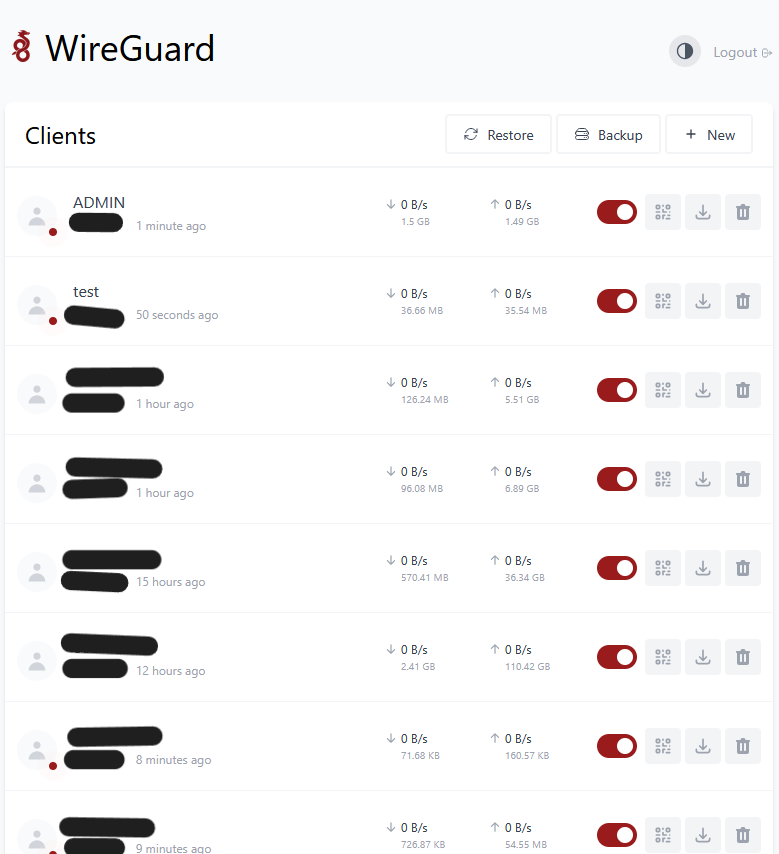

# Nextcloud Server

## Overview

This repository documents my self-hosted Nextcloud deployment running on Ubuntu Server.

The platform is built with Docker Compose and includes PostgreSQL, Redis, Nginx Reverse Proxy and HTTPS using Let's Encrypt.

It serves as my private cloud storage and was extended with an automatic upload workflow to synchronize recordings without relying on the official Nextcloud desktop client.

---

## Architecture

```text
                 Internet
                      │
                DuckDNS Domain
                      │
             Let's Encrypt SSL
                      │
              Nginx Reverse Proxy
                      │
               127.0.0.1:8080
                      │
                 Nextcloud
                  │       │
             PostgreSQL  Redis
```

---

## Technology Stack

- Ubuntu Server 24.04 LTS
- Docker
- Docker Compose
- Nextcloud
- PostgreSQL
- Redis
- Nginx
- Let's Encrypt
- DuckDNS

---

## Features

- Self-hosted cloud storage
- Docker deployment
- PostgreSQL database
- Redis caching
- Reverse proxy
- HTTPS
- Automatic file upload
- Secure remote administration
- Infrastructure documentation

---

## Screenshots

### Ubuntu Server


---

### Docker Containers


---

### Docker Compose Stack


---

### Nginx Status


---

### Nextcloud Dashboard


---

### WireGuard



---

## What I Built

I deployed and configured a complete Nextcloud environment on Ubuntu Server using Docker.

The deployment includes PostgreSQL, Redis, Nginx and HTTPS certificates issued by Let's Encrypt.

To improve daily workflow I also built an automatic upload solution that synchronizes recordings directly to Nextcloud without using the official desktop client.

---

## Challenges

During this project I solved problems related to:

- Docker networking
- Reverse proxy configuration
- HTTPS certificates
- Redis integration
- PostgreSQL configuration
- VPN access
- Automatic uploads
- Infrastructure troubleshooting

---

## What I Learned

- Linux Administration
- Docker Compose
- Container Networking
- Reverse Proxy
- SSL Certificates
- PostgreSQL
- Redis
- Self-hosted Infrastructure
- Troubleshooting

---

## Security

No sensitive information is published.

Removed before upload:

- Passwords
- Tokens
- Private Keys
- Public IP addresses
- Real Domains

---

## Future Improvements

- Monitoring
- Automatic Backups
- CI/CD
- Infrastructure as Code
